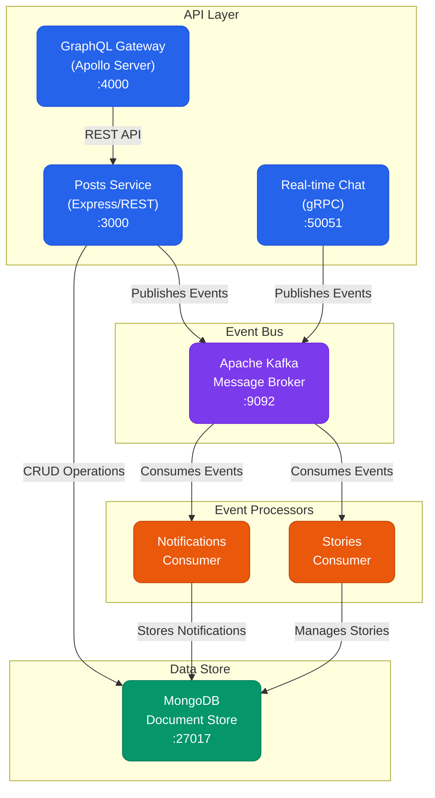

# Réseau Social - Architecture Microservices

## Vue d'Ensemble

Application de réseau social construite avec une architecture microservices, permettant le partage de posts, stories et interactions entre utilisateurs.

## Architecture Technique



## Services Détaillés

### 1. Posts Service (Port 3000)

#### Fonctionnalités
- Création et gestion des posts
- Gestion des likes et commentaires
- Publication de stories éphémères

#### Modèles de Données

##### Posts
- Contenu textuel
- Identifiant de l'auteur
- Compteur de likes
- Liste des commentaires
- Horodatage

##### Stories
- Contenu
- Auteur
- Date de création
- Date d'expiration (24h)

#### API REST

| Endpoint | Méthode | Description | Paramètres |
|----------|---------|-------------|------------|
| /posts | POST | Créer un post | content, userId |
| /posts | GET | Liste des posts | page, limit |
| /posts/:id/like | POST | Liker un post | userId |
| /posts/:id/comment | POST | Commenter | userId, text |
| /stories | POST | Créer une story | content, userId |
| /stories | GET | Stories actives | - |

#### Événements Émis
- POST_CREATED
- POST_LIKED
- COMMENT_ADDED
- STORY_CREATED

### 2. GraphQL Service (Port 4000)

#### Fonctionnalités
- Agrégation des données
- Feed personnalisé
- Requêtes optimisées

#### Types GraphQL

##### Post
- id: ID!
- content: String!
- userId: String!
- likes: Int!
- comments: [Comment!]!
- createdAt: String!

##### Comment
- text: String!
- userId: String!
- createdAt: String!

#### Requêtes Disponibles
- feed(userId: ID!): [Post!]!
- post(id: ID!): Post

### 3. Notification Consumer

#### Fonctionnalités
- Traitement des interactions
- Stockage des notifications
- Gestion de l'état de lecture

#### Modèle de Notification
- Type (LIKE, COMMENT, CHAT_MESSAGE)
- Émetteur (userId)
- Destinataire (targetUserId)
- Références (postId, commentId)
- État de lecture
- Horodatage

#### Topics Écoutés
- notifications

### 4. Stories Consumer

#### Fonctionnalités
- Gestion du cycle de vie des stories
- Suppression automatique après 24h
- Notifications d'expiration

#### Modèle de Story
- Contenu
- Auteur
- Date de création
- Date d'expiration

#### Topics Écoutés
- stories

## Configuration Technique

### Variables d'Environnement
```
MONGODB_URI=mongodb://localhost:27017/social-network
KAFKA_BROKERS=localhost:9092
POSTS_SERVICE_PORT=3000
GRAPHQL_PORT=4000
STORY_EXPIRATION_HOURS=24
```

### Dépendances Principales
- Express.js (API REST)
- Apollo Server (GraphQL)
- KafkaJS (Message Broker)
- Mongoose (MongoDB ODM)

## Guide d'Installation

### Prérequis
- Node.js v14+
- MongoDB 4.4+
- Apache Kafka 2.8+
- Zookeeper

### Étapes d'Installation

1. **Configuration de l'Environnement**
   - Cloner le dépôt
   - Installer les dépendances
   - Configurer les variables d'environnement

2. **Base de Données**
   - Démarrer MongoDB
   - Créer la base de données
   - Initialiser les collections

3. **Message Broker**
   - Lancer Zookeeper
   - Démarrer Kafka
   - Créer les topics requis

4. **Services**
   - Démarrer le service Posts
   - Lancer le service GraphQL
   - Activer les consumers

## Sécurité et Performance

### Sécurité
- Validation des entrées
- Gestion des erreurs
- Logging des événements

### Performance
- Mise en cache GraphQL
- Pagination des résultats
- Indexation MongoDB
- Gestion asynchrone des événements
